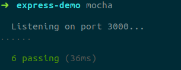
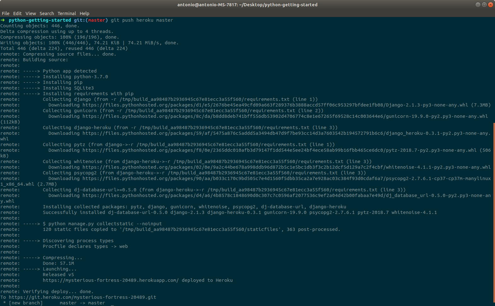
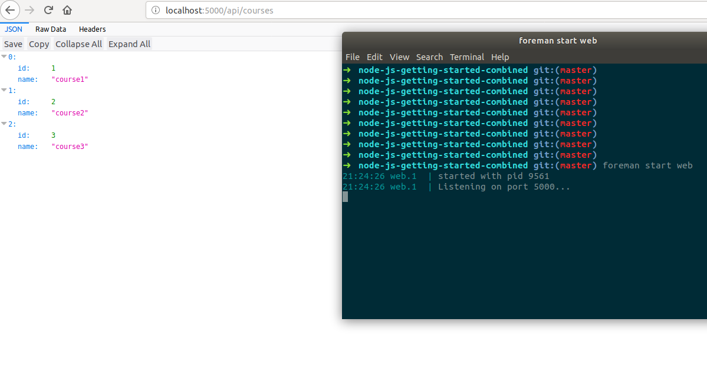

# Desplegando aplicaciones en la nube: Uso de PaaS y DBaaS

### Ejercicio 1. Darse de alta en algún servicio PaaS tal como Heroku, zeit, BlueMix u OpenShift.

Hecho:

### Ejercicio 2. Crear una aplicación en OpenShift o en algún otro PaaS en el que se haya dado uno de alta. Realizar un despliegue de prueba usando alguno de los ejemplos incluidos con el PaaS.

Vamos a realizar el tutorial de Heroku: "Getting Started on Heroku with Python"

* 1. Set up: Instalamos Heroku CLI haciendo:
    ~~~bash
    $ sudo snap install heroku --classic
    ~~~

    e iniciciamos sesión.

* 2. Prepare de app:
    
    Clonamos la aplicación de su repositorio de github:
    ~~~bash
    $ git clone https://github.com/heroku/python-getting-started.git
    ~~~
* 3. Deploy the app:

    Desplegamos la app en Heroku creando primero una app en heroku con

    ~~~bash
    $ heroku create
    ~~~

    esto crea un git remoto asociado con nuestro repositorio local, por lo que para desplegar nuestro código lo hacemos con un push:

    ~~~bash
    $ git push heroku master
    ~~~

### Ejercicio 3. Realizar una app en express (o el lenguaje y marco elegido) que incluya variables como en el caso anterior.

index.js:
~~~js
const Joi = require('joi');
const express = require('express');
const app = express();

app.use(express.json());    // Para parsear el json object.

const courses = [
    {id: 1, name: 'course1'},
    {id: 2, name: 'course2'},
    {id: 3, name: 'course3'},
]

app.get('/', (req,res) => {
    res.send('Hello World!!!!');
});

app.get('/api/courses', (req,res) => {
    res.send(courses);
})

app.post('/api/courses', (req,res) => {
    const {error} = validateCourse(req.body);

    if(error){
        // 400 bad request
        res.status(400).send(error.details[0].message);
        return;
    }
    const course = {
        id: courses.length +1,
        name: req.body.name
    };
    courses.push(course);
    res.send(course);
})

// /api/courses/1
app.get('/api/courses/:id', (req, res) => {
    const course = courses.find(c => c.id === parseInt(req.params.id));
    if (!course) return res.status(404).send('not found the course');
    res.send(course);
}); //:id define un parametro id (id es el nombre del parametro)

// PORT
const port = process.env.PORT || 3000;  // Environment variable PORT (set on temrminal, if it doesnt exists it uses 3000)
app.listen(port, () => console.log(`Listening on port ${port}...`));    // use `` instead of '' so we can use template string $()

app.put('/api/courses/:id', (req,res) => {
    const course = courses.find(c => c.id === parseInt(req.params.id));
    if (!course) return res.status(404).send('not found the course');

    const {error} = validateCourse(req.body);

    if(error){
        // 400 bad request
        res.status(400).send(error.details[0].message);
        return;
    }

    course.name = req.body.name;
    res.send(course);
});

function validateCourse(course){
    const schema = {
        name: Joi.string().min(3).required()    // Usamos Joi para que todas las condiciones de la estructura estén en un mismo sitio y no repetir código
    };
    return Joi.validate(course, schema);
}

app.delete('/api/courses/:id', (req, res) => {
    const course = courses.find(c => c.id === parseInt(req.params.id));
    if (!course) return res.status(404).send('not found the course');

    const index = courses.indexOf(course);
    courses.splice(index, 1);

    res.send(course);
})
~~~
Creado en base al tutorial de https://www.youtube.com/watch?v=pKd0Rpw7O48

### Ejercicio 4. Crear pruebas para las diferentes rutas de la aplicación.

~~~js
var request = require('supertest')
    , assert = require('assert')
    , app = require('../index.js');

describe("infopages", function(){
    it("shows hello world", function(done){
        request(app).get("/")
            .expect(200)
            .expect(/Hello World!!!!/)
            .end(done);
    })
    it("shows courses", function(done){
        request(app).get("/api/courses")
            .expect(200)
            .end(done);
    })
})

describe("Manage Course", function(){

    var curso;
    it("adds a new course", function(done){
        request(app).post("/api/courses")
            .send({ "name": "new course"})
            .expect(200)
            .end(done);
    })

    it("shows expecific course", function(done){
        request(app).get("/api/courses/4")
            .expect(200)
            .expect('Content-Type', /json/)
            .end(done);
    });

    it("modifies a specific course", function(done){
        request(app).put("/api/courses/4")
            .send({ "name": "changed course"})
            .expect(200)
            .expect('Content-Type', /json/)
            .end(done);
    });

    it("deletes a specific course", function(done){
        request(app).delete("/api/courses/4")
            .expect(200)
            .expect('Content-Type', /json/)
            .end(done);
    });
    
})
~~~

### Ejercicio 5. Instalar y echar a andar tu primera aplicación en Heroku.
    ~~~bash
    $ git push heroku master
    ~~~

### Ejercicio 6. Usar como base la aplicación de ejemplo de heroku y combinarla con la aplicación en node que se ha creado anteriormente. Probarla de forma local con foreman. Al final de cada modificación, los tests tendrán que funcionar correctamente; cuando se pasen los tests, se puede volver a desplegar en heroku.

Para combinar la aplicación que hicimos en los ejercicios anteriores con la de prueba de heroku (node-js-getting-started) sustituyo en esta última los archivos index.js, package.json y test.js con los que hemos creado nosotros.
A continuación, en terminal hacemos:

~~~bash
$ npi install joi
~~~
para que instale el paquete que le falta y:
~~~bash
$ npi install
~~~
Si lo ejecutamos ahora localmente con foreman podemos ver que funciona correctamente

### Ejercicio 7. Haz alguna modificación a tu aplicación en node.js para Heroku, sin olvidar añadir los tests para la nueva funcionalidad, y configura el despliegue automático a Heroku usando Snap CI o alguno de los otros servicios, como Codeship, mencionados en StackOverflow

hecho 

### Ejercicio 8. Preparar la aplicación con la que se ha venido trabajando hasta este momento para ejecutarse en un PaaS, el que se haya elegido.

hecho en el repositorio https://github.com/AntonioJavierRP/node-test