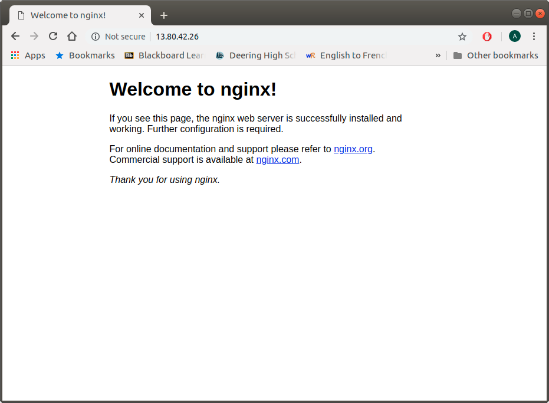
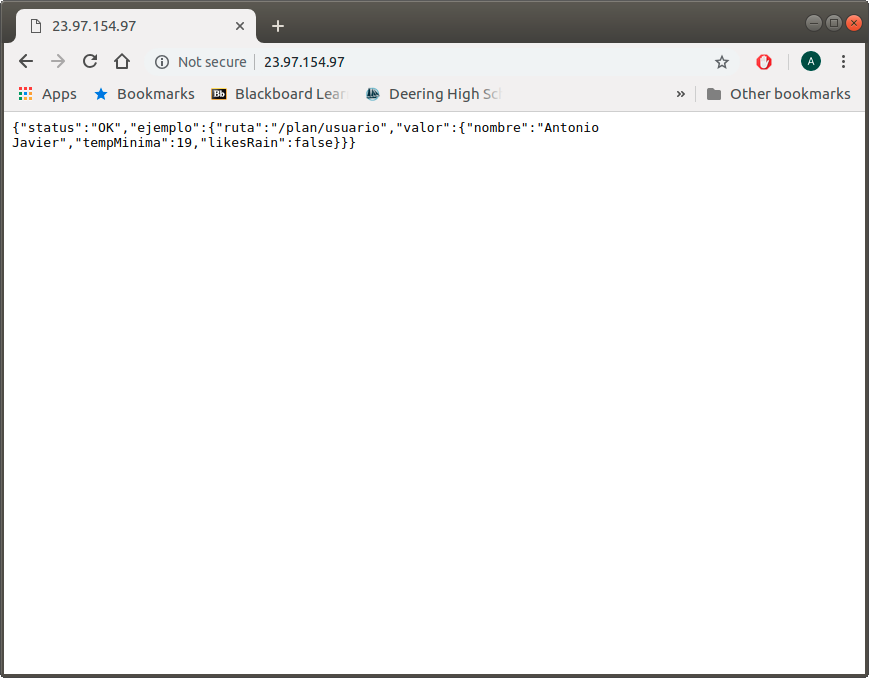

# Automatizando el despliegue en la nube.

### Ejercicio 1. Crear una máquina virtual Ubuntu e instalar en ella un servidor nginx para poder acceder mediante web.

Instalamos azure cli:

        $ npm install -g azure-cli

Para elegir una MV de las disponibles antes tendremos que filtrar la busqueda por localizacion y publisher.
Para ver los publisher disponibles en el este de EEUU haremos:

        $ azure vm image list-publishers    

            info:    Executing command vm image list-publishers
            Location:  eastus
Y se nos mostrará una lista con los publisher disponibles en esa región.

Ahora, por ejemplo, para visualizar las MVs de OpenLogic en el este de EEUU haremos:

        $ azure vm image list

            info:    Executing command vm image list
            Location:  eastus
            Publisher:  OpenLogic

Para crear una MV usaremos azure client 2.0, para ello lo instalamos con apt:

        $ sudo apt-get install azure-cli

A continuación creamos un grupo de recursos:

        $ az group create -l westeurope -n CCGroupEU

        
Y procedemos a crear una mv tal y como dice en las transparencias del tema:

        $ az vm create -g CCGroupEU -n bobot --image UbuntuLTS

Esto nos devuelve:

        {
            "fqdns": "",
            "id": "/subscriptions/0a3cb165-43c4-4ad4-a199-25191713ce51/resourceGroups/CCGroupEU/providers/Microsoft.Compute/virtualMachines/bobot",
            "location": "westeurope",
            "macAddress": "00-0D-3A-45-15-C4",
            "powerState": "VM running",
            "privateIpAddress": "10.0.0.4",
            "publicIpAddress": "13.80.42.26",
            "resourceGroup": "CCGroupEU",
            "zones": ""
        }

nos conectamos con

         $ ssh antonio@13.80.42.26

Instalamos nginx:

        $ sudo apt-get install nginx

Lo iniciamos:
 
        $ sudo /etc/init.d/nginx start

Pero todavía no podremos ver que esta iniciado desde la IP publica, ya que no hemos abierto los puertos. Esto ya lo hacíamos en la practica anterior desde la página de azure, pero debemos aprender a hacerlo desde la linea de comandos, ya que es la idea principal de este tema y nos permitirá hacerlo de forma masiva con muchas mas MVs a la vez.

Para abrir el puerto 80 de nuestra MV haremos:

        $ az vm open-port --resource-group CCGroupEU --name bobot --port 80

Y ahora sí, podemos comprobar el acceso mediante web:

### Ejercicio 2. Crear una instancia de una máquina virtual Debian y provisionarla usando alguna de las aplicaciones vistas en el tema sobre herramientas de aprovisionamiento.

Creamos la Máquina Virtual:

        $ az vm create -g CCGroupEU -n MV-ej2  --image debian

Nos devuelve:

        {
        "fqdns": "",
        "id": "/subscriptions/0a3cb165-43c4-4ad4-a199-25191713ce51/resourceGroups/CCGroupEU/providers/Microsoft.Compute/virtualMachines/MV-ej2",
        "location": "westeurope",
        "macAddress": "00-0D-3A-21-F5-B3",
        "powerState": "VM running",
        "privateIpAddress": "10.0.0.5",
        "publicIpAddress": "23.97.154.97",
        "resourceGroup": "CCGroupEU",
        "zones": ""
        }

Vamos a provisionarla con ansible tal y como hicimos en el hito 3 con la máquina virtual que creamos.
Hago uso del playbook de ese hito y modifico los archivos de configuración para que el usuario y la IP concuerden con el de la máquina virtual que acabo de crear. Por ejemplo ansible_hosts será:

~~~~
[azure]
Azure ansible_ssh_port=22 ansible_ssh_private_key_file=~/.ssh/id_rsa.pub ansible_ssh_host=23.97.154.97

[azure:vars]
ansible_ssh_user=antonio
~~~~

Después de ejecutar el playbook (con $ ansible-playbook playbook.yml) podemos comprobar que efectivamente se ha desplegado correctamente:

### Ejercicio 3. Conseguir una cuenta de prueba en OpenStack y crear una instancia a la que se pueda acceder, provisionándola con algún script disponible.

----

