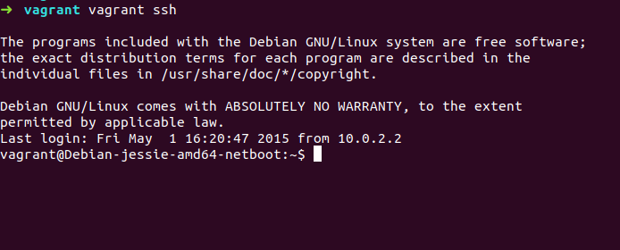

# Gestión de Infraestructuras Virtuales

### Ejercicio 1. Instalar una máquina virtual Debian usando Vagrant y conectar con ella.

Buscamos en http://www.vagrantbox.es/ las máquinas configuradas de Debian y la importamos con la siguiente orden:

~~~~
$ vagrant box add Jessie8 https://github.com/holms/vagrant-jessie-box/releases/download/Jessie-v0.1/Debian-jessie-amd64-netboot.box
~~~~

A continuación, creamos un vagranfile con las opciones por defecto ejecutando:

~~~~
$ vagrant init Jessie8
~~~~
Dentro de un directorio vacío. Y para finalmente crear y arrancar la máquina usaremos la orden "vagrant up".

Nos conectamos a ésta con "vagrant ssh":

### Ejercicio 2. Instalar una máquina virtual ArchLinux o FreeBSD para KVM, otro hipervisor libre, usando Vagrant y conectar con ella.

### Ejercicio 3. Crear un script para provisionar de forma básica una máquina virtual para el proyecto que se esté llevando a cabo en la asignatura. 

### Ejercicio 4. Configurar tu máquina virtual usando 'vagrant' con el provisionador ansible.